# Kits

Kits are an essential part of the game, as you are forced to use one of them every game, and these may even change how you play. There are currently **14** kits, being these: 

<table class="big-table">
	<colgroup span="2" width="85"></colgroup>
	<tr>
		<td height="17" align="left" data-sheets-value="{ &quot;1&quot;: 2, &quot;2&quot;: &quot;Brawler&quot;}"><a href="#Br">Brawler</a></td>
		<td align="left" data-sheets-value="{ &quot;1&quot;: 2, &quot;2&quot;: &quot;a&quot;}">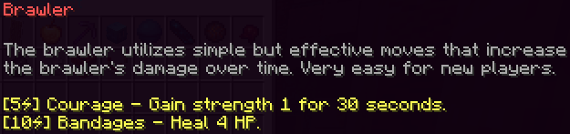</td>
	</tr>
	<tr>
		<td height="17" align="left" data-sheets-value="{ &quot;1&quot;: 2, &quot;2&quot;: &quot;Survivalist&quot;}"><a href="#Sv">Survivalist</a></td>
		<td align="left" data-sheets-value="{ &quot;1&quot;: 2, &quot;2&quot;: &quot;b&quot;}">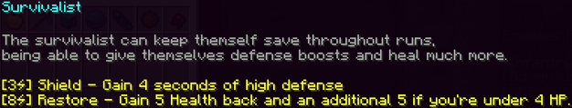</td>
	</tr>
	<tr>
		<td height="17" align="left" data-sheets-value="{ &quot;1&quot;: 2, &quot;2&quot;: &quot;Adventurer&quot;}"><a href="#Ad">Adventurer</a></td>
		<td align="left" data-sheets-value="{ &quot;1&quot;: 2, &quot;2&quot;: &quot;c&quot;}">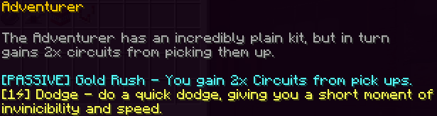</td>
	</tr>
	<tr>
		<td height="17" align="left" data-sheets-value="{ &quot;1&quot;: 2, &quot;2&quot;: &quot;Allay&quot;}"><a href="#Al">Allay</a></td>
		<td align="left" data-sheets-value="{ &quot;1&quot;: 2, &quot;2&quot;: &quot;d&quot;}">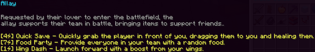</td>
	</tr>
	<tr>
		<td height="17" align="left" data-sheets-value="{ &quot;1&quot;: 2, &quot;2&quot;: &quot;Dark Knight&quot;}">Dark Knight</td>
		<td align="left" data-sheets-value="{ &quot;1&quot;: 2, &quot;2&quot;: &quot;e&quot;}">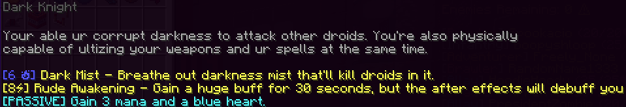</td>
	</tr>
	<tr>
		<td height="17" align="left" data-sheets-value="{ &quot;1&quot;: 2, &quot;2&quot;: &quot;Demolitionist&quot;}">Demolitionist</td>
		<td align="left" data-sheets-value="{ &quot;1&quot;: 2, &quot;2&quot;: &quot;f&quot;}">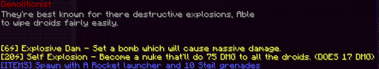</td>
	</tr>
	<tr>
		<td height="17" align="left" data-sheets-value="{ &quot;1&quot;: 2, &quot;2&quot;: &quot;Engineer&quot;}">Engineer</td>
		<td align="left" data-sheets-value="{ &quot;1&quot;: 2, &quot;2&quot;: &quot;g&quot;}">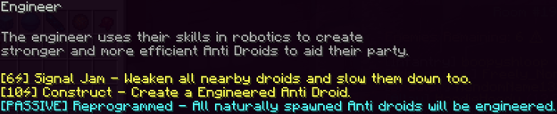</td>
	</tr>
	<tr>
		<td height="17" align="left" data-sheets-value="{ &quot;1&quot;: 2, &quot;2&quot;: &quot;Healer &quot;}">Healer </td>
		<td align="left" data-sheets-value="{ &quot;1&quot;: 2, &quot;2&quot;: &quot;h&quot;}">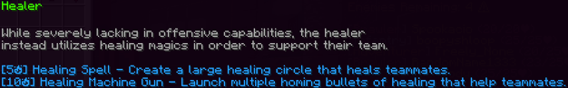</td>
	</tr>
	<tr>
		<td height="17" align="left" data-sheets-value="{ &quot;1&quot;: 2, &quot;2&quot;: &quot;Infantry &quot;}">Infantry </td>
		<td align="left" data-sheets-value="{ &quot;1&quot;: 2, &quot;2&quot;: &quot;I&quot;}">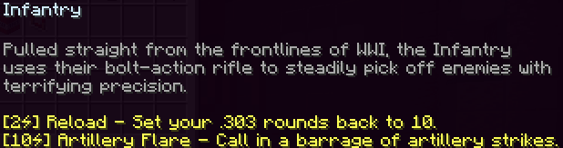</td>
	</tr>
	<tr>
		<td height="17" align="left" data-sheets-value="{ &quot;1&quot;: 2, &quot;2&quot;: &quot;Rogue Droid&quot;}">Rogue Droid</td>
		<td align="left" data-sheets-value="{ &quot;1&quot;: 2, &quot;2&quot;: &quot;j&quot;}">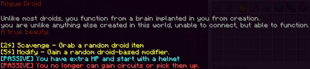</td>
	</tr>
	<tr>
		<td height="17" align="left" data-sheets-value="{ &quot;1&quot;: 2, &quot;2&quot;: &quot;Scorcher&quot;}">Scorcher</td>
		<td align="left" data-sheets-value="{ &quot;1&quot;: 2, &quot;2&quot;: &quot;k&quot;}">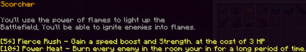</td>
	</tr>
	<tr>
		<td height="17" align="left" data-sheets-value="{ &quot;1&quot;: 2, &quot;2&quot;: &quot;Sorcerer &quot;}">Sorcerer </td>
		<td align="left" data-sheets-value="{ &quot;1&quot;: 2, &quot;2&quot;: &quot;l&quot;}">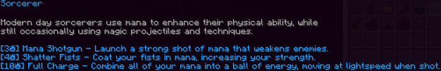</td>
	</tr>
	<tr>
		<td height="17" align="left" data-sheets-value="{ &quot;1&quot;: 2, &quot;2&quot;: &quot;Team Captain&quot;}">Team Captain</td>
		<td align="left" data-sheets-value="{ &quot;1&quot;: 2, &quot;2&quot;: &quot;m&quot;}">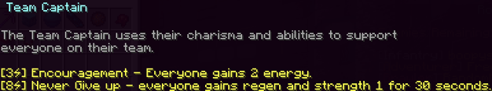</td>
	</tr>
	<tr>
		<td height="17" align="left" data-sheets-value="{ &quot;1&quot;: 2, &quot;2&quot;: &quot;Wizard &quot;}">Wizard </td>
		<td align="left" data-sheets-value="{ &quot;1&quot;: 2, &quot;2&quot;: &quot;n&quot;}">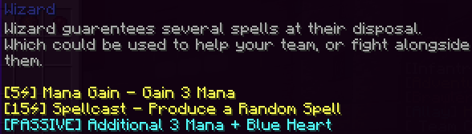</td>
	</tr>
	<tr>
		<td height="17" align="left" data-sheets-value="{ &quot;1&quot;: 2, &quot;2&quot;: &quot;Mole &quot;}">Mole </td>
		<td align="left" data-sheets-value="{ &quot;1&quot;: 2, &quot;2&quot;: &quot;o&quot;}">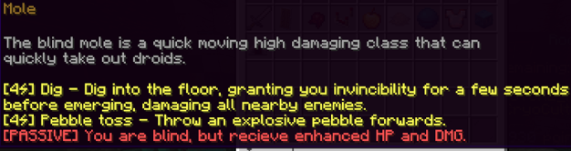</td>
	</tr>
</table>

# Brawler 

*"The brawler utilizes simple but effective moves that increase the brawlers damage over time. Very easy for new players."* - The ingame inventory.

Brawler is one of the two starter kits, along with <a href="#Sv">Survivalist</a>.

## Description

Brawler is a close-ranged attacker, with good survivability and great starting damage output. This class does especially well in the early game.

## Abilities

The Brawler has one starting weapon, as well as two abilities and one passive.

| Name | Uses | Description |
|-|-|-|
| Brawler Blade | N/A | In game description says 8 Damage, when in reality it only does 4. This low damage is offset by its high attack speed. |
| Courage |	5 Energy | Gain Strength 1 for 30 seconds. |
| Bandages | 8 Energy | Heals 4 health instantly, and gives Regeneration 2 for 30 seconds. This always totals to a full heal for the Brawler class.|
| Red Heart | N/A | You heal for 1 health each new room. Passive. |

### Trivia
* Brawler's heal doesn't mention the regeneration in the game description. This means that players expecting a 4 health heal end up getting a full heal instead.
* Brawler's weapon was originally a copper sword, being changed to a stronger weapon for balancing.

# Survivalist 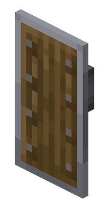

*"The survivalist can keep themselves safe throughout runs, being able to give themselves defense boosts and heal much more."* - The ingame inventory.

Survivalist is one of the two starter kits, along with <a href="#Br">Brawler</a>.

## Description

Survivalist is a close-ranged attacker that is able to block out dangerous attacks and outlive most other classes.

## Items & Abilities

The Survivalist has four items, two of which are abilities and one of which is a passive.

| Name | Uses | Description |
|-|-|-|
| Tough Shield | N/A | Deals 5 damage per hit, which is ironically higher than <a href="#Br">Brawler</a>. The attack speed, however, is rather low. Gives +5 Max Health while held.|
| Shield |	3 Energy | Gain Resistance 6 for 4 seconds. |
| Restore | 8 Energy | Heals for 5 health. If the player is currently below 4 health, they heal for 10 instead. |
| Red Heart | N/A | You heal for 1 health each new room. Passive. |

### Trivia

* Survivalist used to have a copper sword.
* Before the <a href="#Br">Brawler</a> buff, Survivalist was the best starting class by a longshot.
* Survivalist's Shield is one of the cheapest invincibility moves next to <a href="#Ad">Adventurer</a>.

# Adventurer 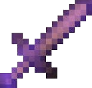

*"The Adventurer has an incredibly plain kit, but in turn gains x2 circuits from picking them up."* - The ingame inventory.

Adventurer is a Kit you get from the Class Shop. 

## Description

Adventurer is focused on getting loads of circuits to shop to your hearts content, along with being able to dash out of tricky situations by using the Adventurer Blade.

## Items & Abilities

The Adventurer starts with one item, with a singular ability as a part of this item.

| Name | Uses | Description |
|-|-|-|
| Adventurer Blade | N/A | 6 Damage + Fire Damage (9 damage total). |
| Dash (Adventurer Blade) |	1 Energy | Move forward 5 blocks when on ground, and 12 in the air. You gain resistance while dashing. |

### Trivia

* In the description of the Adventurer Blade, it is believed the sword was stolen from Soteria, as the *"sleeping woman in a cave"*. Other evidence supporting it is its ability to set enemies on fire.
* Adventurer is currently the only kit with a circuit multiplier.

# Allay

*"Requested by their lover to enter the battlefield, the allay supports their team in battle, bringing items to support their friends."* - The ingame inventory.

Allay is a Kit you get from the Class Shop.

## Description

Allay is a support oriented kit that uses movement and healing abilities to quickly save their allies from danger.

## Items & Abilities

The Allay starts with 4 items, 3 of which are abilities.

| Name | Uses | Description |
|-|-|-|
| Allay Spear | N/A | 4 Damage |
| Quick Save | 4 Energy | Pull targetted player for a few seconds. Heal this player for 10 health. |
| Food Party | 7 Energy | Give a random food item to all living players. |
| Wing Dash | 1 Energy | Boosts yourself forward. Has no cooldown. (2 blocks on ground, 9 in air.) |

### Trivia

* The Allay was the first kit to be added upon a player's request.
* The description of the kit is a reference to the player who suggested the kit, named **allaylover**.
* The Allay's Quick Save ability used to heal players for 20 health, until it was later nerfed to 10.
* When the Testing Room was first added, players had used Food Party to give infinite food to players. This was patched almost immediately.