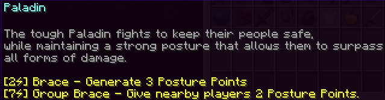
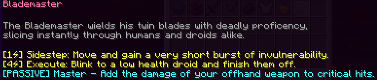
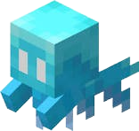
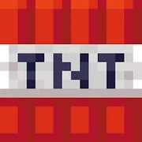
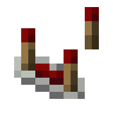
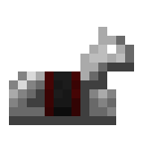
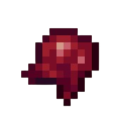

# Kits

Kits are an essential part of the game, as you are forced to use one of them every game, and these may even change how you play. There are currently **14** kits, being these: 

<table class="big-table">
	<colgroup span="2" width="85"></colgroup>
	<tr>
		<td height="17" align="left" data-sheets-value="{ &quot;1&quot;: 2, &quot;2&quot;: &quot;Brawler&quot;}"><a href="#Br">Brawler</a></td>
		<td align="left" data-sheets-value="{ &quot;1&quot;: 2, &quot;2&quot;: &quot;a&quot;}"></td>
	</tr>
	<tr>
		<td height="17" align="left" data-sheets-value="{ &quot;1&quot;: 2, &quot;2&quot;: &quot;Survivalist&quot;}"><a href="#Sv">Survivalist</a></td>
		<td align="left" data-sheets-value="{ &quot;1&quot;: 2, &quot;2&quot;: &quot;b&quot;}"></td>
	</tr>
	<tr>
		<td height="17" align="left" data-sheets-value="{ &quot;1&quot;: 2, &quot;2&quot;: &quot;Adventurer&quot;}"><a href="#Ad">Adventurer</a></td>
		<td align="left" data-sheets-value="{ &quot;1&quot;: 2, &quot;2&quot;: &quot;c&quot;}"></td>
	</tr>
	<tr>
		<td height="17" align="left" data-sheets-value="{ &quot;1&quot;: 2, &quot;2&quot;: &quot;Allay&quot;}"><a href="#Al">Allay</a></td>
		<td align="left" data-sheets-value="{ &quot;1&quot;: 2, &quot;2&quot;: &quot;d&quot;}"></td>
	</tr>
	<tr>
		<td height="17" align="left" data-sheets-value="{ &quot;1&quot;: 2, &quot;2&quot;: &quot;Dark Knight&quot;}"><a href="#Dk">Dark Knight</a></td>
		<td align="left" data-sheets-value="{ &quot;1&quot;: 2, &quot;2&quot;: &quot;e&quot;}"></td>
	</tr>
	<tr>
		<td height="17" align="left" data-sheets-value="{ &quot;1&quot;: 2, &quot;2&quot;: &quot;Demolitionist&quot;}"><a href="#De">Demolitionist</a></td>
		<td align="left" data-sheets-value="{ &quot;1&quot;: 2, &quot;2&quot;: &quot;f&quot;}"></td>
	</tr>
	<tr>
		<td height="17" align="left" data-sheets-value="{ &quot;1&quot;: 2, &quot;2&quot;: &quot;Engineer&quot;}"><a href="#En">Engineer</a></td>
		<td align="left" data-sheets-value="{ &quot;1&quot;: 2, &quot;2&quot;: &quot;g&quot;}"></td>
	</tr>
	<tr>
		<td height="17" align="left" data-sheets-value="{ &quot;1&quot;: 2, &quot;2&quot;: &quot;Healer &quot;}"><a href="#He">Healer</a></td>
		<td align="left" data-sheets-value="{ &quot;1&quot;: 2, &quot;2&quot;: &quot;h&quot;}"></td>
	</tr>
	<tr>
		<td height="17" align="left" data-sheets-value="{ &quot;1&quot;: 2, &quot;2&quot;: &quot;Infantry &quot;}"><a href="#In">Infantry</a></td>
		<td align="left" data-sheets-value="{ &quot;1&quot;: 2, &quot;2&quot;: &quot;I&quot;}"></td>
	</tr>
	<tr>
			<td height="17" align="left" data-sheets-value="{ &quot;1&quot;: 2, &quot;2&quot;: &quot;Rogue Droid&quot;}"><a href="#Rd">Rogue Droid</a></td>
		<td align="left" data-sheets-value="{ &quot;1&quot;: 2, &quot;2&quot;: &quot;j&quot;}"></td>
	</tr>
	<tr>
		<td height="17" align="left" data-sheets-value="{ &quot;1&quot;: 2, &quot;2&quot;: &quot;Scorcher&quot;}">Scorcher</td>
		<td align="left" data-sheets-value="{ &quot;1&quot;: 2, &quot;2&quot;: &quot;k&quot;}"></td>
	</tr>
	<tr>
		<td height="17" align="left" data-sheets-value="{ &quot;1&quot;: 2, &quot;2&quot;: &quot;Sorcerer &quot;}">Sorcerer </td>
		<td align="left" data-sheets-value="{ &quot;1&quot;: 2, &quot;2&quot;: &quot;l&quot;}"></td>
	</tr>
	<tr>
		<td height="17" align="left" data-sheets-value="{ &quot;1&quot;: 2, &quot;2&quot;: &quot;Team Captain&quot;}">Team Captain</td>
		<td align="left" data-sheets-value="{ &quot;1&quot;: 2, &quot;2&quot;: &quot;m&quot;}"></td>
	</tr>
	<tr>
		<td height="17" align="left" data-sheets-value="{ &quot;1&quot;: 2, &quot;2&quot;: &quot;Wizard &quot;}">Wizard </td>
		<td align="left" data-sheets-value="{ &quot;1&quot;: 2, &quot;2&quot;: &quot;n&quot;}"></td>
	</tr>
	<tr>
		<td height="17" align="left" data-sheets-value="{ &quot;1&quot;: 2, &quot;2&quot;: &quot;Mole &quot;}">Mole </td>
		<td align="left" data-sheets-value="{ &quot;1&quot;: 2, &quot;2&quot;: &quot;o&quot;}"></td>
	</tr>
	<tr>
		<td height="17" align="left" data-sheets-value="{ &quot;1&quot;: 2, &quot;2&quot;: &quot;Mole &quot;}">Paladin</td>
		<td align="left" data-sheets-value="{ &quot;1&quot;: 2, &quot;2&quot;: &quot;o&quot;}"></td>
	</tr>
	<tr>
		<td height="17" align="left" data-sheets-value="{ &quot;1&quot;: 2, &quot;2&quot;: &quot;Mole &quot;}">Blademaster</td>
		<td align="left" data-sheets-value="{ &quot;1&quot;: 2, &quot;2&quot;: &quot;o&quot;}"></td>
	</tr>
</table>

# Brawler 

*"The brawler utilizes simple but effective moves that increase the brawlers damage over time. Very easy for new players."* - The ingame inventory.

Brawler is one of the two starter kits, along with <a href="#Sv">Survivalist</a>.

## Description

Brawler is a close-ranged attacker, with good survivability and great starting damage output. This class does especially well in the early game.

## Abilities

The Brawler has one starting weapon, as well as two abilities and one passive.

| Name | Uses | Description |
|--|-|----|
| Brawler Blade | N/A | In game description says 8 Damage, when in reality it only does 4. This low damage is offset by its high attack speed. |
| Courage |	5 Energy | Gain Strength 1 for 30 seconds. |
| Bandages | 8 Energy | Heals 4 health instantly, and gives Regeneration 2 for 30 seconds. This always totals to a full heal for the Brawler class.|
| Red Heart | N/A | You heal for 1 health each new room. Passive. |

### Trivia
* Brawler's heal doesn't mention the regeneration in the game description. This means that players expecting a 4 health heal end up getting a full heal instead.
* Brawler's weapon was originally a copper sword, being changed to a stronger weapon for balancing.

# Survivalist 

*"The survivalist can keep themselves safe throughout runs, being able to give themselves defense boosts and heal much more."* - The ingame inventory.

Survivalist is one of the two starter kits, along with <a href="#Br">Brawler</a>.

## Description

Survivalist is a close-ranged attacker that is able to block out dangerous attacks and outlive most other classes.

## Items & Abilities

The Survivalist has four items, two of which are abilities and one of which is a passive.

| Name | Uses | Description |
|--|-|----|
| Tough Shield | N/A | Deals 5 damage per hit, which is ironically higher than <a href="#Br">Brawler</a>. The attack speed, however, is rather low. Gives +5 Max Health while held.|
| Shield |	3 Energy | Gain Resistance 6 for 4 seconds. |
| Restore | 8 Energy | Heals for 5 health. If the player is currently below 4 health, they heal for 10 instead. |
| Red Heart | N/A | You heal for 1 health each new room. Passive. |

### Trivia

* Survivalist used to have a copper sword.
* Before the <a href="#Br">Brawler</a> buff, Survivalist was the best starting class by a longshot.
* Survivalist's Shield is one of the cheapest invincibility moves next to <a href="#Ad">Adventurer</a>.

# Adventurer 

*"The Adventurer has an incredibly plain kit, but in turn gains x2 circuits from picking them up."* - The ingame inventory.

Adventurer is a Kit you get from the Class Shop. 

## Description

Adventurer is focused on getting loads of circuits to shop to your hearts content, along with being able to dash out of tricky situations by using the Adventurer Blade.

## Items & Abilities

The Adventurer starts with one item, with a singular ability as a part of this item.

| Name | Uses | Description |
|--|-|----|
| Adventurer Blade | N/A | 6 Damage + Fire Damage (9 damage total). |
| Dash (Adventurer Blade) |	1 Energy | Move forward 5 blocks when on ground, and 12 in the air. You gain resistance while dashing. |

### Trivia

* In the description of the Adventurer Blade, it is believed the sword was stolen from Soteria, as the *"sleeping woman in a cave"*. Other evidence supporting it is its ability to set enemies on fire.
* Adventurer is currently the only kit with a circuit multiplier.

# Allay 

*"Requested by their lover to enter the battlefield, the allay supports their team in battle, bringing items to support their friends."* - The ingame inventory.

Allay is a Kit you get from the Class Shop.

## Description

Allay is a support oriented kit that uses movement and healing abilities to quickly save their allies from danger.

## Items & Abilities

The Allay starts with 4 items, 3 of which are abilities.

| Name | Uses | Description |
|--|-|----|
| Allay Spear | N/A | 4 Damage |
| Quick Save | 4 Energy | Pull targetted player for a few seconds. Heal this player for 10 health. |
| Food Party | 7 Energy | Give a random food item to all living players. |
| Wing Dash | 1 Energy | Boosts yourself forward. Has no cooldown. (2 blocks on ground, 9 in air.) |

### Trivia

* The Allay was the first kit to be added upon a player's request.
* The description of the kit is a reference to the player who suggested the kit, named **allaylover**.
* The Allay's Quick Save ability used to heal players for 20 health, until it was later nerfed to 10.
* When the Testing Room was first added, players had used Food Party to give infinite food to players. This was patched almost immediately.

# Dark Knight 

*"Your able to corrupt darkness to attack other droids. You're also physically capable of utilizing your weapons and your spells at the same time."* - The ingame inventory.

Dark Knight is a Kit you get from the Class Shop.

## Description

Dark Knight is a close range tanky kit with powerful offensive and defensive capabilities.

## Items & Abilities

The Dark Knight starts with 5 items, 2 of which are abilities and one of which is a passive. They also begin with 3 additional mana.

| Name | Uses | Description |
|--|-|----|
| Darksteel Greatsword | N/A | Deals 9 Damage, however the description says it deals 8. |
| Dark Dagger | N/A | Deals 2.5 damage, though it says 4 in the description. Has a very high attack speed.|
| Parry (Darksteel Greatsword) | N/A | Gives Slowness 2 and Weakness 1 for an extremely short time. If you take damage for this time, it is blocked. |
| Heavy Slam (Darksteel Greatsword) | N/A | Deal 12 damage to enemies near you after a short delay.|
| Rude Awakening | 8 Energy | Gain Speed 2, Resistance 1, and Strength 1 for 30 seconds. After this, gain Weakness 1 and Slowness 2 for 10 seconds. |
| Dark Mist | 5 Mana | Creates a large cloud of darkness that deals low damage over time to droids in its radius, knocking them back as well. Damage varies drastically. |
| Blue Heart | N/A | You gain 1 mana per new room. Passive. |

### Trivia

* The Dark Knight is one of the strongest starting kits in the game due to its wide range of abilities.
* The Dark Knight's Parry originally was much stronger, meaning the Dark Knight was effectively invincible. This was nerfed very heavily, but is still a strong ability.
* This kit was made by vexour, who is notorious for making overpowered items in the community.

# Demolitionist 

*"They're best known for their destructive explosions, able to wipe droids fairly easily."* - The ingame inventory.

Demolitionist is a Kit you get from the Class Shop.

## Description

Demolitionist is a ranged crowd control kit with powerful offensive capabilities.

## Items & Abilities

The Demolitionist starts with 5 items, 3 of which are abilities, one of which is a ranged weapon, and one of which is a melee weapon.

| Name | Uses | Description |
|--|-|----|
| Copper Sword | N/A | Deals 4 Damage. |
| Rocket Launcer | N/A | Shoots a projectile that explodes on hit. Damage varies, though direct shots deal 5 damage + 2 from fall damage. |
| Steil Grenade x10 | 1 Energy | Shoots a projectile, similar to Rocket Launcher. Deals 7 damage directly on hit. Is used up when thrown. |
| Self Explosion | 20 Energy | You explode after a short delay, dealing 75 damage to nearby droids, but 17 damage to yourself. |
| Explosive Dam | 6 Energy | Spawns a bomb where you are looking that explodes after a short time. Deals 15 damage + 2 from fall damage. |

### Trivia
* Demolitionist's Self Explosion is the highest energy cost of any ability currently in the game.
* Rocket Launcher originally had limited uses. When that limit was first removed, the class was seen as overpowered, but the limit hasn't been readded since.

# Engineer 

*"The engineer uses their skills in robotics to create stronger and more efficient Anti Droids to aid their party."* - The ingame inventory.

Engineer is a Kit you get from the Class Shop.

## Description

Engineer is a unique support kit that spawns and buffs Anti Droids to fight for the team.

## Items & Abilities

The Engineer starts with 6 different items, 1 of which is a melee weapon, 1 of which is a passive, 3 of which are abilities, and 1 of which is consumables.

| Name | Uses | Description |
|--|-|----|
| Copper Sword | N/A | Deals 4 Damage. |
| Signal Jam | 5 Energy | Gives Slowness(?) and Weakness(?) to nearby droids. |
| Construct | 10 Energy | Spawns an Engineered Anti Droid to fight with you. |
| Anti Droid Engineering License | N/A | All Anti Droids automatically become Engineered Anti Droids. Passive.|
| Engineer Banner x2 | N/A | Spawns an Anti Droid. Consumed upon use.|
| Super Enhance | 8 Energy | Upgrades an Anti Droid into a Super Anti Droid, giving it +15 health and other stat improvements.|

### Trivia
* Engineer is referenced in a tip, saying "10 Engineers = 20 Anti-Droids". This is a reference to the 2 Engineer Banners that this kit starts with.
* *"The Super Enhance works on one other kit. (Hint: Super Rogue Droid)"* - That Guy

# Healer 

*"While severely lacking in offensive capabilities, the healer instead utilizes healing magics in order to support their team."* - The ingame inventory.

Healer is a Kit you get from the Class Shop.

## Description

Healer is a support class that uses healing spells to keep their team alive in battle.

## Items & Abilities

| Name | Uses | Description |
|--|-|----|
| Copper Sword | N/A | Deals 4 Damage. |
| Healing Spell | 5 Mana | Spawns a large circle that heals players in its radius over time, totalling 7.5 health healed per player. |
| Healing Machine Gun | 10 Mana | Shoots many small homing projectiles that heal allies. |
| Mana Gain | 5 Energy | Gain 3 Mana. Effectively acts as a conversion from 5 energy to 3 mana. |
| Blue Heart | N/A | You gain 1 mana per new room. Passive. |

### Trivia
* Healing Spell used to be part of the Mage Stick as well, though it was since removed.
* Healer is one of the only classes in the game that has access to the Mana Gain ability.

# Infantry 

* *"Pulled straight from the frontlines of WWI, the Infantry uses their bolt-action rifle to steadily pick off enemies with terrifying precision."* - The ingame inventory.

Infantry is a Kit you get from the Class Shop.

## Description

Infantry is a long range class that specializes in picking off specific enemies.

## Items & Abilities

| Name | Uses | Description |
|--|-|----|
| Lee-Enfield | 1 Ammunition | Fires a long range projectile that pierces through 2 enemies (hitting 3 total), dealing 8 damage.|
| Ammunition x10 | N/A | Acts as ammo for the Lee-Enfield and its evolutions. |
| Reload | 2 Energy | Refills your ammo to max (default is 10). |
| Artillery Flare | 10 Energy | Throws a projectile that, after a delay, spawns many explosions from the sky, dealing damage in a large area.|

### Trivia
* Infantry was the first class to start with an evolvable weapon, that being Lee-Enfield.

# Rogue Droid 

*"Unlike most droids, you function from a brain implanted in you from creation. You are unlike anything else created in this world, unable to connect, but able to function."*

*"A true beauty"* - The ingame inventory.

Rogue Droid is a kit you get from the Class Shop.

## Description

Rogue Droid is a verstile class with randomness. Rogue Droid uses their abilities to obtain items rather than the shop.

## Abilities

The Rogue Droid has a starting hat, as well as two abilities.

| Name | Uses | Description |
|--|-|----|
| Salvage| 2 Energy | Gives a random droid item. |
| Modify | 5 Energy | Gives a random droid modifier. |
| Droid Hat | N/A | You gain 5 max health. |

### Trivia
* Rogue Droid is the only class that does not can **Not** pick up circuits
* Is considred by most to be the hardest class to play
* Has a secret kit upgrade that requires another class to activate.
