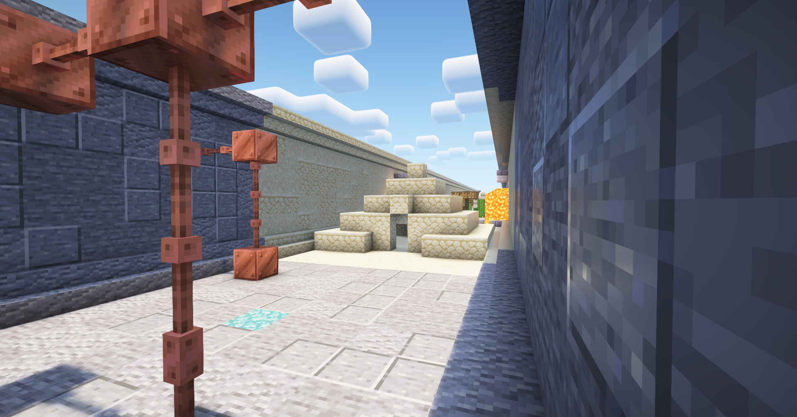
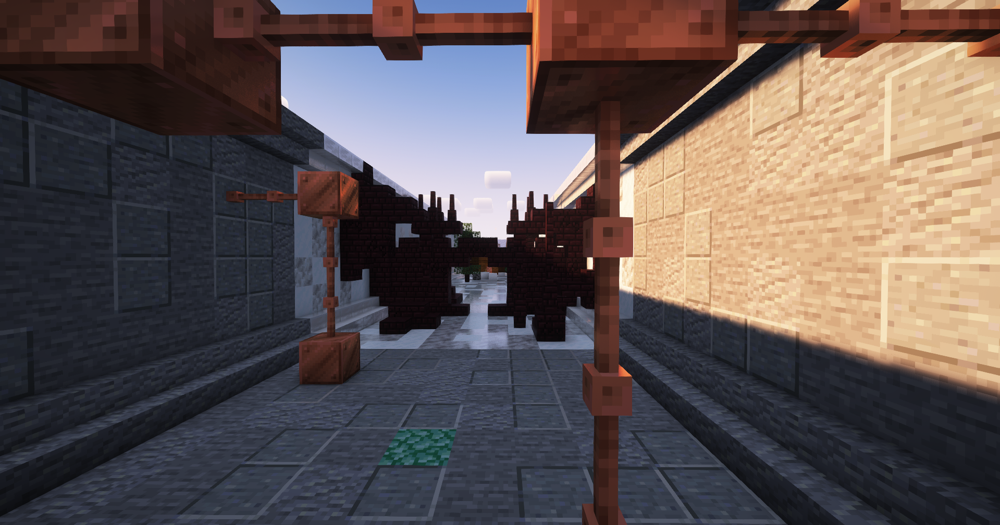
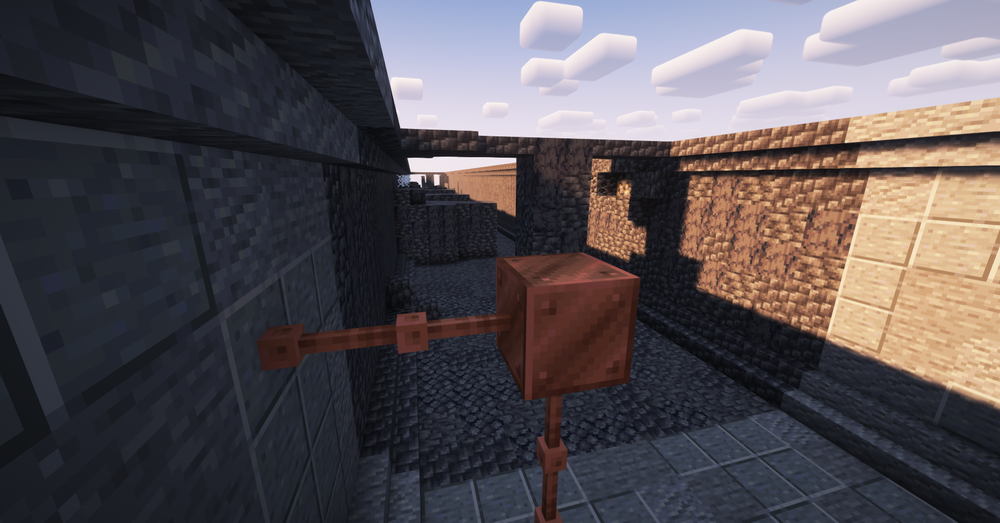
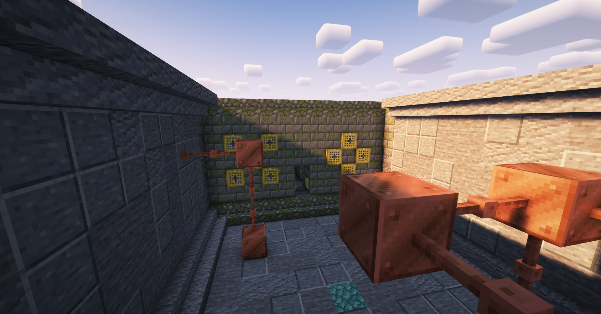
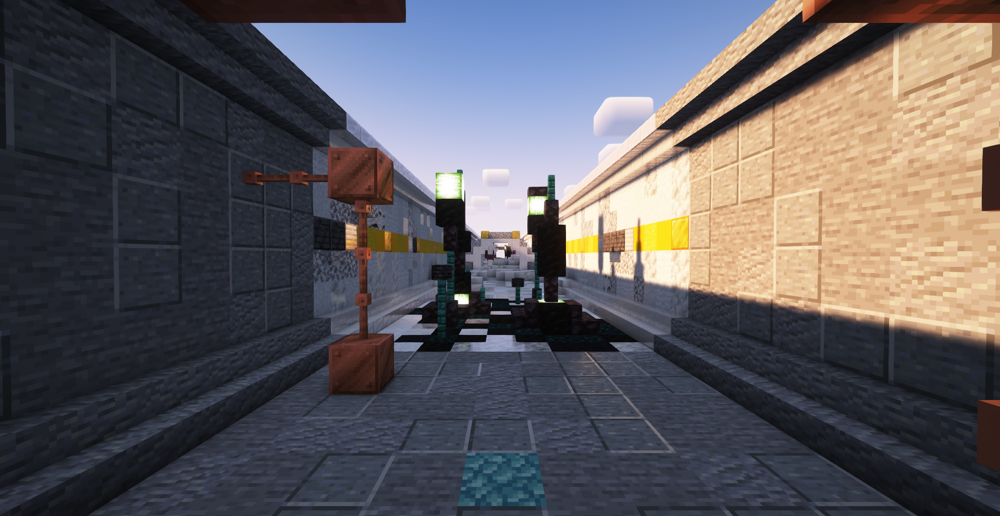
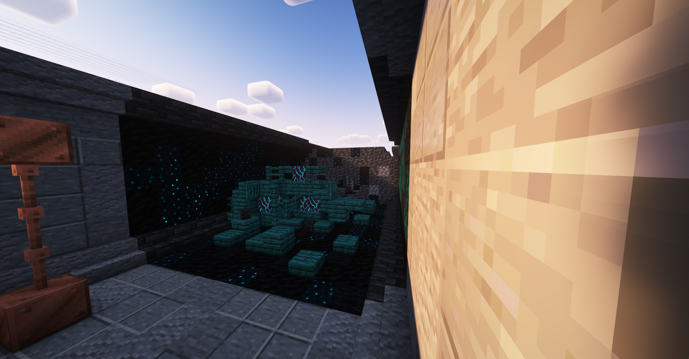

# Levels

Levels (Referred to as "Rooms inside the main game") are in groups of 10 in RGDs, containing 9 randomly chosen maps depending on the current group of rooms, progressively becoming more difficult over time, and a shop room that has a friendly droid hosting a small offering of 3 different items. Depending on the level, there may be a boss fight, or short encounter. There are currently **90** playable rooms with plans for more.

## Lobby:

Where you spawn once you join, simple little place to hang out in.

## Level 1, The Lab:

Where everything starts, things will start easy here. Nothing crazy.

## Level 2, Dersertian Wasteland:

Watch out! Explosive Droids will start spawning in this level and beyond.

## Level 3, Snowdanian Tundra:

Look around, there are Yeti Droids that may freeze you to death!

## Level 4, The Dungeon:

Things get a lot tougher from here, and where the first boss chills around.

## Level 5, The Mishko Temple:

Uh oh! There are Posionous Droids that may linger around you.

## Level 6, Heavenly Sanctuary:

Despite the name, this is not Heavenly in any way, watch out for Guardian Droids.

## Level 7, The Depths:

Be careful, your vision is very limited here, so a Shark Droid may get you!